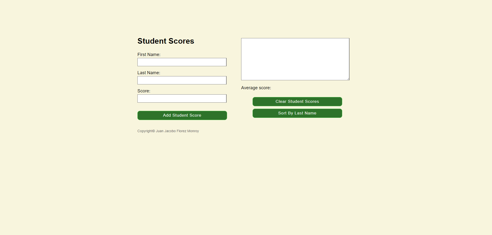

# 📝 Student Scores Application

## 📌 Project Overview

The **Student Scores Application** is an interactive tool designed to **manage student scores** efficiently. Users can **add student details**, calculate **average scores**, and **sort or clear entries** dynamically. This project demonstrates **form handling, input validation, sorting mechanisms, and DOM manipulation**.

Developed as part of a **college assignment**, this project focuses on enhancing **JavaScript skills**, including event handling and dynamic content updates.

---

## 🚀 Features

- 📋 **Add Student Scores** – Input a **student's first name, last name, and score** to add it to the list.
- 📊 **Calculate Average Score** – Automatically computes and **displays the average score**.
- 📝 **Display Student List** – Lists student names and scores dynamically.
- 🔄 **Sort By Last Name** – Organizes the student list alphabetically.
- 🧹 **Clear All Entries** – Resets the form and clears the student list.

---

## 🛠 Technologies Used

- **HTML5** → Structures the user interface.
- **CSS3** → Provides styling for a clean and accessible design.
- **JavaScript (ES6)** → Handles logic for adding, sorting, and clearing student data.
- **jQuery** → Simplifies event handling and DOM manipulation.

---

## 🎯 Project Purpose

This project was developed as part of a **college assignment**, allowing me to:

- ✅ Implement **JavaScript-based form handling and validation**.
- ✅ Enhance **DOM manipulation** for interactive elements.
- ✅ Apply **sorting algorithms** to organize student data.
- ✅ Practice **responsive UI development** for usability.
- ✅ Improve **data management techniques** through JavaScript.

---

## 📂 Project Structure

```
📁 student_scores
 ├── 📁 imgs/              # Image assets (icons, backgrounds, etc.)
 ├── 📄 index.html         # Main HTML file for the application
 ├── 📄 scores.css         # Stylesheet for layout and design
 ├── 📄 scores.js          # JavaScript for input validation and dynamic updates
```

---

## 🏃‍♂️ How to Use the Application

1️⃣ **Open the Application** – Launch `index.html` in a web browser.
2️⃣ **Enter Student Details** – Input **first name, last name, and score**.
3️⃣ **Add Student Score** – Click **"Add Student Score"** to store the data.
4️⃣ **Sort By Last Name** – Click **"Sort By Last Name"** to organize entries alphabetically.
5️⃣ **Clear Student Scores** – Click **"Clear Student Scores"** to reset the form.

---

## 📝 Code Highlights

### Dynamic DOM Updates

- Updates the student list and **average score dynamically**.
- Displays real-time feedback for **input validation**.

```javascript
$("#add_button").click(() => {
    const first_name = $("#first_name").val().trim();
    const last_name = $("#last_name").val().trim();
    const score = $("#score").val().trim();

    if (!first_name || !last_name || !score || isNaN(score)) {
        alert("Please fill in all fields correctly.");
        return;
    }

    const studentScore = `${last_name}, ${first_name}: ${score}`;
    studentsNamesScores.push(studentScore);
    displayScores(scoreValues, studentsNamesScores);
});
```

### Sorting Functionality

```javascript
$("#sort_button").click(() => {
    studentsNamesScores.sort();
    displayScores(scoreValues, studentsNamesScores);
});
```

---

## 🌟 Future Improvements

- 📊 **Score Range Validation** – Ensure scores fall within **0-100**.
- 💾 **Data Persistence** – Implement **local storage** to save scores.
- 📂 **Export Options** – Enable users to **export** data as CSV or PDF.
- 🔢 **Enhanced Sorting** – Include sorting by **first name** or **score**.

---

## 🎭 Screenshots  

| Student Scores App |  
|--------------|  
|  |  

---

## 📜 License

This project was developed for **educational purposes** as part of a **college assignment**.

---

## 💼 Author

👤 **Juan Jacobo Florez Monroy**  
🌐 **Portfolio**: [jjacobo95.com](https://jjacobo95.com)  
🐙 **GitHub**: [github.com/jjacoboflorez95](https://github.com/jjacoboflorez95)